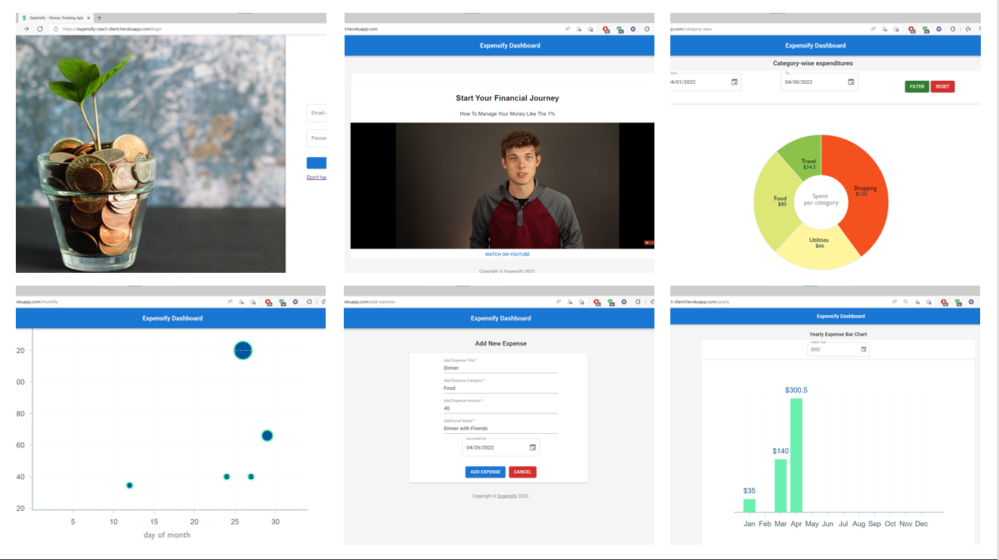

# Expensify – Expense Tracker App

A full-stack web application to log, categorize, and manage daily expenses. Built to help users improve financial tracking, this app replaces traditional pen-and-paper accounting with a seamless digital experience.

---

## Live App

🔗 [https://expensify-react-client.herokuapp.com/login](https://expensify-react-client.herokuapp.com/login)

---

## Application Summary



Expensify enables users to:
- Record and manage expenses
- Visualize spending trends
- Maintain a secure personal expense history
- Analyze summary reports

---

## Domain Model


---

## User Stories

- ✅ Users can register and create accounts  
- ✅ Users can log in securely  
- ✅ Users can create, view, edit, and delete expenses  
- ✅ Users can view categorized summaries  
- ✅ Users can filter and sort expenses  
- ✅ Expense data is stored and retrievable from a database  
- ✅ Supports multiple users with isolated data  

---

## Features

- JWT-based secure authentication  
- Responsive and modern UI with Material UI (MUI)  
- State management with Redux  
- Secure password hashing  
- RESTful API with Express and MongoDB  
- CI/CD deployment via GitHub Actions and Heroku  
- Expense data filtering, sorting, and summaries  
- Notification support using Notistack and React Toastify  
- Integration with YouTube player in Help section  

---

## Tech Stack

### Frontend
- ReactJS
- Redux & Redux Thunk
- SCSS / SASS
- Material UI (MUI)
- AntD Components

### Backend
- NodeJS
- ExpressJS
- MongoDB with Mongoose
- Express Validators

### DevOps / Deployment
- Heroku
- GitHub Actions
- Environment Variables

---

## Getting Started

### React App Setup

```bash
cd client
npm install
npm run start
```

### Node Server Setup

```bash
cd server
npm install
npm run start
# OR
nodemon server.js
```

---

## API Documentation

🔗 [Postman Collection](https://www.getpostman.com/collections/350ed45fe324d2aefbd3)

---

## Deployment Instructions

```bash
heroku login
heroku create <app_name>
git push heroku main
```

---

## Libraries & Resources

- [Emotion](https://www.npmjs.com/package/@emotion/react) – styling
- [Material UI](https://mui.com/) – component library
- [Axios](https://axios-http.com/docs/intro) – HTTP client
- [Javascript-time-ago](https://timeago.org/) – readable time formats
- [Notistack](https://github.com/iamhosseindhv/notistack) – snackbars
- [React Toastify](https://aleab.github.io/toastify/) – toast notifications
- [Heroku Deployment Guide (YouTube)](https://www.youtube.com/watch?v=2AIL1c-cJM0)

---

## License

**The MIT License (MIT)**

Copyright (c) 2022

Permission is hereby granted, free of charge, to any person obtaining a copy of this software and associated documentation files (the "Software"), to deal in the Software without restriction...

> _See full license text above or in the LICENSE file_

---

## Acknowledgment

This project was initially a group submission but has been **individually recreated and deployed** to demonstrate full-stack development capabilities as a solo contributor.

---
